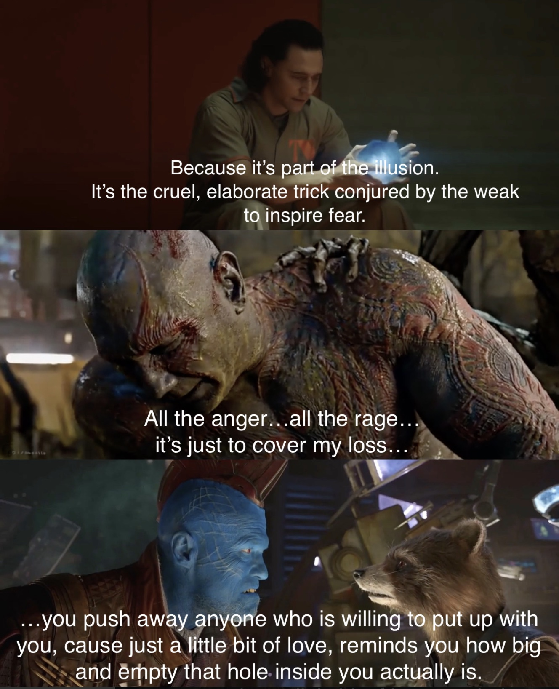

Welcome to Week 2 of my blog!

I ended up have two separate posts during the week that I have already posted with video/audio version included. One was on Jackson Wang's video LMLY:

[https://georgewangyu.me/w2-lmly-jackson-wang-music-video-review](https://georgewangyu.me/w2-lmly-jackson-wang-music-video-review)

`video: https://youtu.be/_zKUrCfOtJw`

The other is about the French Open semifinal, where Nadal lost for only the 3rd time in his entire career at Roland Garros.

[https://georgewangyu.me/w2-djokovic-beats-nadal-at-roland-garros-in-sf-french-open-final-preview](https://georgewangyu.me/w2-djokovic-beats-nadal-at-roland-garros-in-sf-french-open-final-preview)

`video: https://youtu.be/0dADouI7_8k`

Originally I thought there wouldn't be much for me to write this week. But during the week I eventually felt like there was so much to write that separating some posts from the weekly blog was warranted. I probably could've split more things up more since some topics do seem standalone rather than being crammed into a weekly format. But for now playing it by ear will probably suffice.

A video version of the blog below will be slowly rolled out through the week and updated on the site. Stay tuned!

So this week, I want to talk about:

## Youtube and Generating Virality

`video: https://www.youtube.com/watch?v=A5L4Fx00-SQ`

The way I see youtube is that there are two essential components to being successful: viral videos help garner new viewers (hence new subscribers), whereas consistent posts help generate loyal followers. 

Doing an audio/video version of my blog is fun and really helps maintain consistency on the channel. But of course, in order to get viewers you need to generate a viral hit. 

So I guess the challenge now is to figure out, what has a good chance of generating virality? I'm not really sure, but I do know that beyond the usual weekly blog videos I need to maybe plan out and script some videos as well. I expect these videos to be a lot better produced, with a planning phase, storyboarding of the shots, probably some rehearsal (first filmed with iphone, then camera), followed by some sweet editing and cool b-roll.

There's one genre of videos that have always fascinated me, which is a day in the life videos. The reason is because I really think that most people, not just kids, have no idea what various careers beyond what they do looks like. As a result, I think it would be extremely valuable to show a professional's work life in a video. 

With that being said, COVID has made things really boring and it's not so easy to plan with someone to film them right now. I guess I could probably just film myself first and try to make it look as interesting as possible. 

Unfortunately, youtube is already saturated with students who show a day in the life in university. Also some students have a better advantage due to branding of their school, such as being at Harvard. I definitely don't have much second-mover advantage here.

Sooo.... what if I actually, just for fun, scripted an extremely unrealistic day in the life video? Basically I'll just have everything that as a teenager I expected university to be, cram into a day, or maybe even a week. It could be title something like:

- An unrealistic day in the life at UBC where I find love at first sight
- An unrealistic day in the life at UBC where I go partying
- An unrealistic day in the life at UBC where I am productive
- An unrealistic day in the life at UBC where I actually make food
- An unrealistic day in the life at UBC where I go hiking

Since I literally just saw the LMLY video by Jackson Wang, I'm imagining it would be interesting to do exactly what he did, as a student. I could do similar shots, but themed around a student life. Essentially it would be kind of a parody of LMLY (but sort of in Day in the Life theme)?

One of my friends brings up an interesting point though, **which is that if I don't shoot the montage well enough it could seem really cheap looking and just super boring.** I definitely agree, Jackson had a full cast, a full movie crew to help him film, which I definitely do not have. This is also a pretty ambitious first attempt at a viral video, so it would probably be better for me to start somewhere else. (I'm looking at the shots he took again, and literally some of them would be impossible for me to achieve, like the opening scene where they use a drone with a stabilizer to go through the diner.

One way I could deal with this is perhaps having the LMLY parody be only a very small portion of showing my entire day. That way it would still feel like a vlog, sprinkled with a bit of movie-esque cinematography. Essentially it would be something like: I gets up, I go to class, I meet this girl at a coffee shop, we go to the beach, and then go back home. **One issue could be that the transition from something vlog style to movie-esque cinematography would be really hard.**

Doing a video like this is too ambitious, maybe I should work with the **shopping montage video idea.** 

**We were also thinking about how I could get a cute girl to agree to help act in this. That might also be a problem hahaha.**

She also took the opportunity to tell me that I needed to start working out and change my hairstyle and generally put more effort in my appearance. Change my hairstyle... I don't need to listen to her, I don't need to listen to anyone.

**I have a hair appointment tomorrow at 3:30 pm.**

A couple days ago I showed her a picture of me back in 2016 and she said that there's no way that is me. Maybe I have gotten fat and generally more lethargic because of weight. So I do need to go to the gym. My strength is also a bit low in basketball and it'll probably help with my mental energy.

## Workout

I decided to read up on training programs and do some research on working out. Boy is it more complicated than I originally thought. All of these online programs are a mess, there are so many being advertised and it is hard to tell what information actually matters. I suppose in the end it doesn't matter what program you do, the consensus is that as beginner you will see gains no matter what. I do think that it's important to understand the difference between hypertrophy and strength training. Will do some more research next week.

## Coding

I added email subscription to my site and ability to embed video to my website.

Reflecting on my mindset in terms of coding, I would say in general the way one thinks about programming is very different from my academic science-based background, which is a lot of memorization. I guess for some reason I just thought at a certain point I would know how to code and would just be able to do everything, and it doesn't really work like that. You pretty much have to learn how to google the exact question you are looking for. In RStudio, it would be something like how do I manipulate data in a specific way, like changing the row names, or in websites how do I embed a video into my page. Once you've searched it up maybe 3 or more times you probably don't need to google it anymore, but of course other problems come up and once again you have to google it.

The reason it's so different from academics is because during tests you are expected to just know everything. Programming is not like that, you just have to know where to find the solution that most likely someone has already done before. 

Also it's important to plan out what you want to code, which I never tend to do. 

## Reddit Post of the Week

[https://www.reddit.com/r/AskReddit/comments/nuu2q4/a_lot_of_famous_recipes_are_claimed_to_be_made/](https://www.reddit.com/r/AskReddit/comments/nuu2q4/a_lot_of_famous_recipes_are_claimed_to_be_made/)

**A lot of famous recipes are claimed to be made with love, but what’s a dish that’s probably made with hatred?**

- *Anything 2 minutes before closing by a line cook*
- *Potato chips were supposedly invented out of spite. Supposedly the story goes some rich guy kept complaining that the cook a guy named George Crum kept messing up the potatoes he was serving. So George sliced the potatoes really thin, fried them to a crisp, and salted them. The customer loved them and other customers started ordering potatoes that way.*
- *Haribo sugar free gummy bears. They’re composed of concentrated wrath*
- *Extreme hot sauces. They're not made for flavor or enjoyment, they're designed to destroy the mouth, stomach and asshole of whoever eats it*

## News of the Week

### WWDC 2021:

- Not much happened on the hardware side of things, people expected Macbook Pro 14 inch and 16 inch but this still hasn't happened. A lot industry insider lost bets because they had thought it was going to happen, one guy shaved his goatee, one guy shaved his eyebrows. Anyhow I'm not really in the market right now for a new laptop so I'm not too worried. However I will say that using the M1 Macbook Pro, which is what I have right now, it is significantly better and more power efficient than pretty much any intel based chip from past versions. The Intel Macbook Pro that I have was more expensive when I got it, yet slower, battery is way worse, and the fans are constantly on when I have too many chrome tabs. I have yet to see that problem with the M1 Macbook, plus the battery life is just so much better. So I would say if you don't have M1, wait for the new Macbook pro to come out possibly in the fall before school starts, it's been rumoured also that the new Macbook pro also has an SD card and HDMI reader, which I just want to say thank you for bring it back and making filmmaker lives much easier

`video: https://www.youtube.com/watch?v=6jypIrxqhXo`

### Logan Paul and Floyd Mayweather fight:

- Logan was solid and used his advantages of reach, weight and height well. Both of them know how to make money. Good for them. Also people who say Logan was lucky should watch another exhibition in Japan where Floyd knocked out really badly the other person. I would say you have to give respect to how hard he worked to get through all 8 rounds of the fight and not make it a complete joke. Good on them and it'll be interesting to see sheds more light on how underpaid fighters are.

### Euro's 2021:

- I'm of course going to be cheering for England, a place I lived in during my early childhood. We have amazing attacking players, hopefully Maguire will be good to go to anchor the defense. There is cautious optimism, I just don't want to be like all of the guys in English media that overhype the squad.

## Person of the Week: Rich Brian

`video: https://youtu.be/qAyjL868Ytc`

This guy is amazing. I hadn't really seriously watched any of his music videos or his music too much, but watching them now you realize how talented he was from a really young age. The dark humour that he uses in his videos is something that few people can pull of. I just don't think it would suit someone like me, but his videos are super interesting and designed to be viral hits. Like his 20 second video of putting bread in a microwave is genius, but I don't think I would be able to pull something off like that. His Love In My Pocket is also interesting, I think I've seen the idea somewhere, but again it maximizes opportunity for others to come in and react to his video by doing effects on his green screen.

I also might be over-interpreting but to me he gives Good Will Hunting movie character vibes. What I mean by that is Will in the movie is a genius who knows a lot from the books he read about life. But in a defining dialogue of the movie his therapist tells him that he thinks he knows what it's like out there, being an artist, painter, philosopher, having a wife, but he's only read about it. 

Experience is different from reading it in a book. Will used books as a protective mechanism to learn about life in a safe way, without having to experience the pain and anxiety that comes with **real life.**

In a strange way, I get the same vibes from Rich Brian. Like he's heard all this rap music and seen parts of American culture. He's probably seen other guys having girlfriends and heard them talk about going to school with their friends. But his reality is that he was home schooled in Indonesia and didn't really have friends for most of his life. He acts like he knows, but he really doesn't, which is why he can joke about this stuff in a music video. He has to keep up this persona in a way. Now that he's famous, hopefully he's smart enough to slowly experience everything he's heard about and not go too over board.

Seems like he's also currently pivoting to a more pop style genre, hopefully it goes well for him.

*Going on a bit of a tangent here and connecting this to my idea of youtube videos. I was watching a clip of Rich Brian talking about how he came up with his first viral hit, Dat Stick. It's interesting because he is trying to imitate what he heard in trap music, but he was able to put a twist into it in the music video. I honestly think it's a pretty example of what I was talking about in terms of consistency and viral hits. Consistency allows you to copy good artists. In this case Rich Brian just had fun rapping, that was his consistent work. Viral hits require imitation with a slight twist, which is what he did in his music video. Obviously this doesn't talk about original art or work, which is generally so new that it most likely will not go viral. But I remember a Jay-Z talked about it at length in an interview about how he was going at making art but also getting paid for it. He was at the music business, which was different from making music. Some pure artist's hit you with the "oh but I make real art and I don't compromise to get viral hits". That's fine but it's just interesting to try to do both. So basically the steps are:*

1. Find something fun you can get consistent at.
2. Being consistent will help you imitate the great artists in that field without it seeming unnatural.
3. Viral hits require a slight twist to what you are copying.
4. Repeat or break out of this cycle to try and invent something new. 

## Loki, the Disney Plus Tv Series

`video: https://www.youtube.com/watch?v=O4tNsV8bPXg`

I don't really have much to say after the first episode, other than it was okay. However there are some interesting things I've seen on reddit about Loki.

Tom Hiddleston impression of Owen Wilson (who plays Mobius) from a long time ago:

[https://www.reddit.com/r/marvelstudios/comments/nxl20r/tom_hiddleston_doing_a_impression_of_owen_wilson/](https://www.reddit.com/r/marvelstudios/comments/nxl20r/tom_hiddleston_doing_a_impression_of_owen_wilson/)

It's interesting how much psychopaths can actually influence the people around them:

  

Small detail of animations in the TVA animation scene:

  

I'm probably still going to watch it, hopefully the series picks up after the first few episodes.

That's it for this week's blog. See you guys next Sunday!