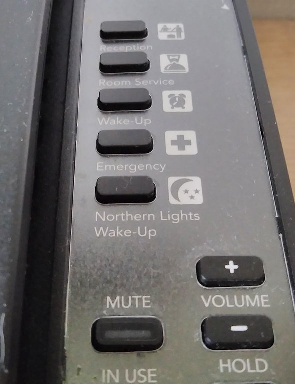

This has been a kind of slow week for my blog. I've had some thoughts circulating but nothing really too concrete to which I felt a visceral need to put it in writing. A lot of these ideas are kind of abstract and I don't really have concrete ideas to support them. Also have you guys seen the video I recently made for youtube this week? It's about how millennials make food:

`video: https://youtu.be/7qlHL2RCiVo`

## Macro vs Micro

Anyhow, one thing I want to mention is macro vs micro. I think both are important. But usually one interrupts the other. 

When we're too focused on the micro it can be troublesome when going through a difficult time. Many of us get stuck on a particular thing not going well and attach much of our identity towards that one thing. It's definitely important to think of the big picture during that time and look at the direction you're going. As long as the direction is a positive one, the feeling is temporary. 

When we're too focused on the macro, a lot of times it interrupts our enjoyment of improving on the little things. If you're always thinking about your big goal all the time (like getting that job, getting that publication, finishing a career defining art piece, win a gold medal, getting married), it's hard to enjoy the small wins. It's really easy to get frustrated when things aren't progressing the way you want them to. 

I guess both sort of mean similar things where we could be too focused on short-term or long-term results rather than the process. Anything that interrupts the process is a taxing feeling, because it is almost added inertia for the next time you try and get back to work due to the weight of expectations.

Sometimes it is better to think less. For me at least, overthinking things can be a problem.

## What is a hard task?

Okay the rest of this section is pretty confusing, but I decided to just keep it in the blog anyhow. Feel free to skip this.

In a funny oxymoronic way, it might easier to do things that are harder. Fundamentally, harder things generally have a higher barrier to entry. Consequently, less people work on harder things. This decreases competition. 

When something has low barrier to entry, anybody can do it. Therefore it actually creates close to perfect competition, making it harder to distinguish yourself amongst your peers. 

I'm jumbling a bunch of definitions together. I'm sort of equating level of difficulty to higher barrier of entry and less competition which is not necessarily true. But I'm just saying that a lot of times the common perception may be that something seems extremely hard, but in reality it  probably provides much better upside due to low competition.

My friend Irwin says it's really hard to measure any of this. I agree. But for the fun of it, let's hypothesize some things:

1. There are professions that already have perfect competition, making it extremely hard to stand out.
2. Hard things have high barrier to entry, but lower competition.
3. Lower competition means that it is actually easier to stand out once initial inertia is broken. There is much better potential reward.

I'll probably do some stats analysis on some of these hypotheses for next week of the blog. But there's a link about getting into Harvard that talks a bit about this idea (basically he's saying it's better to do something hard because it's easier to stand out, rather than spreading your work on various easy things):

[https://blog.prepscholar.com/how-to-get-into-harvard-and-the-ivy-league-by-a-harvard-alum](https://blog.prepscholar.com/how-to-get-into-harvard-and-the-ivy-league-by-a-harvard-alum)

## Book of the Week

If you're looking for a summer read during this unbelievable heat wave, a book I would recommend is Flowers of Algernon. No lie, I probably cried like 3 separate times during the book. It is an emotional roller coaster. I think what gets me the most is when you know what's wrong with you. But you can't fix it. That sucks.

For example (this is an example from a debate show I watched), imagine a scenario where you walk up to a young toddler and they start crying. The toddler runs back to their parents. You go overhear the toddler say that they're crying because you are really ugly and scary looking. You can say don't worry about it kid, I'm really smart. Don't worry about it kid, I'm a really great musician. I'm a fantastic scholar. I'm really nice. But you know in that moment there's one thing you can't really change... you're appearance. 

Or maybe you are really smart, but all of the sudden you got amnesia. You know your intellectual ability from before, but there's not much you can do if you can't remember things. 

Or you got an injury and could never play a sport that you loved again.

These examples are kind of similar to Charlie in Flowers for Algernon. I won't spoil it but basically it feels like there's a helplessness there due to circumstance. I'm not talking about just the start of the book either. 

Learned helplessness is a pretty scary thing. For the most part I hope that there are solutions to make something better, no matter how difficult they are. But again, I kind of want to stress that maybe the result doesn't even matter and to not think about a specific short-term or long-term ending that you want. 

*That's the thing about human life--there is no control group, no way to ever know how any of us would have turned out if any variables had been changed.*

## My Chinese Debate Script

谢谢主席，问候在场各位。开宗明义，定义先行，今天我们所讨论的乘风破浪和稳住别浪是年轻人的两种生活风格。乘风破浪指勇往直前、具有创新精神，愿意尝试新的挑战，承担风险。稳住别浪却是小心谨慎、拒绝风险，倾向于依赖已有优势，做事循规蹈矩（xunguidaoju) (*I literally didn't know how to pronounce this idiom, so had to write the pinyin in my script*)。而这场辩论的判准，应该在于何者能够帮助年轻人实现自我价值。我方认为目前社会大部分的年轻人已经满足了Maslow最基本的生存需求，普遍有能力去进行物质基础以上的精神需求。根据亚里士多德的德性心理学，人的存在意义是寻求并实现自我价值。

而我们有乘风破浪才可以打破社会刻板印象的枷锁去找到自我价值。原因如下：

首先，年轻人应该乘风破浪尝试新的挑战去寻找自己真正想要的是什么，并且知道自己的界限。根据pediatrics的文章，从2005到2014，四分之三的90后在工作里由于工作的压力感到抑郁。年轻人有两个特点：在内卷社会中压力巨大，并由于缺少经验（缺乏）不知道自己想要什么，适合什么。而我们如果多尝试才能知道和对比，找到自己界限，我们可以做什么。这样的话也能知道工作上那些可以做的好，那些超越我的界限。这个标准就不会需要周围人帮你定义。不光是收入，我们论证年轻人需要乘风破浪才可以有对比一份工作到底适不适合我们。

第二，年轻人承担风险得到的经历丰富。心理学有个道理叫flashbulb memory(闪光灯记忆)，就是你有高情绪的体验，你会记得很清楚。假如说一个人第一次坐了过山车，她很害怕是一种冒险，他就是能记住这个经历。而承担风险，我方观点是年轻人可以为未来所积累的多样的经验和经历，因为在做不同的事情。包括如果仔细想一想，其实冒险越晚，风险越大。

- 冒险是我们能得都经历很重要的方式
- 包括你年龄大了这个冒险会越来越有

人到中年上有老下有小，此时此刻的失败影响（牵动）的不只是自己，而且风险的本质就是成功率可能性渺小（且重来并成功的可能性渺小）。所以我们需要年轻时候冒险去培养我们的多维度和经验。

第三，年轻人有责任去尽量改善规则和刻板印象，因为这样我们才能得到我们的自我价值。第一，年轻非常适合打破改善世界。90后的本科毕业生是39%，90前是15%。93%的90后有手机，68%的50岁以上的用手机， 70岁以上用40%。年轻人从小就接受到高科技和高信息量的世界。

另外社会具备了一个很重要的物理因素，叫惯性。这个世界的规则和刻板印象有多难打破？就是因为惯性很强。比如说越来越多的女生选择理工科，以前这些都是默认为男性主导的专业。我们现在的高科技都是年轻发明的，因为你必须其实你许要有这种乘风破浪的态度才能去打破惯性。为什么必须是年轻的时候才有这个态度呢？

因为你年龄越大，世界会越来越影响你的野心。如果你年轻没有野心改变世界，这个世界会把你变的磨平稜角。你如果想改变世界，你必须要年轻的时候去改变。包括你要有乘风破浪的态度，要不然你没有办法打破世界强大的惯性。乘风破浪是你最大的武器去面对世界给你的惯性的打击。这样年轻人着个群体才能实现我们德性心理学所说的自我价值。

综上所述，我方认为年轻人唯有乘风破浪，才能实现自我价值。

So last week we had a debate competition. I didn't know it was going to be an actual competition, until like maybe a couple days prior. Then I started freaking out. What I don't like about actual debate competitions is that you cannot include personal anecdotes, as they don't really add factual evidence to your argument. As a result, debate competitions are essentially essays, which sucks because I want to get better at storytelling through personal anecdotes. 

Lots of drama also with the University of Toronto team. They were copying scripts from the internet during the actual competition... but oh well. We ended up losing, overall I thought our team and I learned a lot. 

## Youtube Comments That Hurt The Most

I was watching Casey Neistat's old vlogs the other day and he said that most hate comments don't hurt him because they are just wildly inaccurate. Over his many years of being youtube famous, those types of generic hate comments don't really faze him. 

However, even after all this time there is one type of comment that will still penetrate deep enough, past his well built thick skin.

Those are the comments that actually have a hint of truth to them, generally something he probably wants to bury. 

It's because this brings a lot of questions.
The person who sees through that, means they know you all too well?

Or did one not bury the thing well enough? 

Does one's heart already have too many hidden compartments?

Social media is a pretty scary place.

## Reddit Post of the Week

### My hotel phone in Iceland has a special button that will wake you up if there are northern lights in the sky:

  

[https://www.reddit.com/r/mildlyinteresting/comments/o8v2mm/my_hotel_phone_in_iceland_has_a_special_button/](https://www.reddit.com/r/mildlyinteresting/comments/o8v2mm/my_hotel_phone_in_iceland_has_a_special_button/)

See you guys in next week's blog!