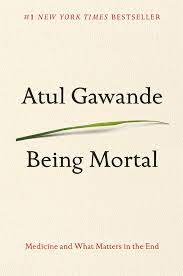

Alright so this week's blog started with so much ranting that I decided to just delete all of it. 

But....

First of all, sometimes Friday nights can be the worst when you're single. Friday feels like the day where you want to reflect late at night and just talk through your thoughts with someone. If there isn't a person like that it sucks. Not to say my friends aren't there. I feel fortunate to have great friends to spend time with and to talk about many topics. It's just different, I don't care how late you spend the night going out, you still go to a pretty dead silent home.

I have been reading though....

## Book Recommendation of the Week

  

Actually this is something I read a long time ago, but I really like the book Being Mortal. I love the book's explanation on how as we age. We slowly deal with a baseline level of physical condition that decreases in increments, like a staircase. Generally speaking, physical condition doesn't deteriorate as quickly as we expect, we slowly adapt to each baseline before dropping another staircase down. The book also talks about how accidents occur that drop you quite low, but people always rebound to some type of baseline that might be lower than before. Any Atul Gawande also challenges the conventional wisdom of geriatrics, many of the points I agree with. Highly recommend if you're looking for a summer read about medicine. 

## Tokyo Olympics Recap

### Mixed Doubles Badminton Final

Quite an interesting match. The number one seeds had won two straight world championships and had beaten the number two seeds from China multiple times in the past. Unfortunately the pressure got to them both and it took them quite a while to get into the match. They ended up losing the third game 21-19. Was quite an exciting match, but feel bad for the clear number 1 seed going to the tournament.

### Weightlifting

Lu Xiaojun wins olympic gold at 37, the oldest winning weightlifter in history. GOAT.

## Some videos I've watched during the olympics

### Diving vs. Weighlifting Can Lü Xiaojun & Chen Aisen Switch Sports?

`video: https://youtu.be/Ka1M0QZScmM`

### Shi Zhiyong (weightlifter double Olympic Champion) swears everytime he does anything

`video: https://www.youtube.com/watch?v=og3lpiNHZE4`

### Shi Zhiyong power cleans his way to world title

`video: https://www.youtube.com/watch?v=iJPkZscgJhw`

### Lu Xiaojun roasts amateur's lifting form

`video: https://youtu.be/hPX2ZJgjGLs`

## Process

Designing process is probably the most difficult thing for me (for anybody for that matter) because my natural personality is to work out of instinct. I feel the momentum and I go from there. Or maybe I'm just making an excuse as all novices would do. 

But really process is what separate the masters from the novices. The masters can do the same thing over and over again. Their process is sustainable. You can only get excited about something for so long. You need a process to warm up, work and cool down.

Some of the questions I've been asking myself is:

1. In sports having coaching is awesome cause they help you build process, I wish there was more coaching like that in real life.
2. Process is hard because it needs to exist in the simplest form of the activity and yet also be very adaptable based on the day
3. Goals are tricky because it needs to be achievable on the short term
4. Every activity must be split up into their simplest base unit in order to work

Process I feel is everything. It's so difficult to find the process that works for yourself. But the more I go through things the more I feel like that process determines the goal, not vice versa.

See you guys next week!