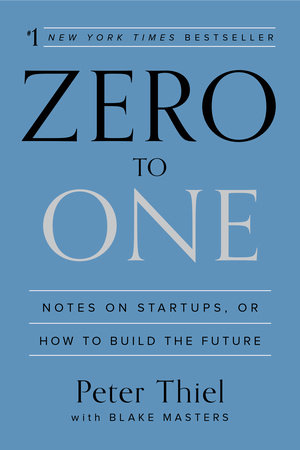

Alright so what story do I want to tell this week, let's see. 

Oh.

A few days ago I went to go play basketball with a different group. I would say they were a bit tougher than my usual crew. 

Everyone was tall, strong, fast. Except for one of my friends who was there. 

He's short and skinny, but he could shoot.

By the time we finished warming up, everyone was getting their game faces on and was ready to go. I didn't really warm up that seriously, but I never do because I'm too lazy to warm up. Usually it goes fine though.

Not that day.

I played two scrimmage games in total. I couldn't make an open shot. I couldn't rebound. I was getting blown by on drives. I was getting blocked. 

Besides that, it was fine 🤣.

Maybe it was a bit of nerves playing with a newer group. My shot was also still super rusty given I hadn't played consistently after wisdom teeth surgery and a shoulder injury. 

So I guess the bright side was that I could do a lot better after getting back to the swing of things. But no excuses though, I was bad.

I'm going to honest. Midway through the second game, I got to the point where I was like, f—- this, I'm going to practice drills from now on to get better than all these guys. I just hate it when I'm putting others in that awkward position where they are like: do I pick this guy on my team and risk losing or should we just go with him and be nice? Being a liability is no fun. 

Let me tell you the exact moment that I made the transition from "oh basketball is a fun game hooray" to "f—- I need to get a lot better". 

There were two separate plays where I got a wide open lay up because they were doubling our best player -who also happens to be the best player in the group. 

First one was on the right side. I make a sharp cut. I'm wide open. 

Clear daylight. I get the pass. 

Hands up, follow through on the shot.

It hits the backboard way too hard and rims out on the other side. 

A couple made baskets later, the score is now 10-6 for us (I actually didn't realize at the time we only needed one more basket, as games go up to 11). This time I make a cut to the left side of the hoop. To my credit, I was still playing decent defence and cutting well, even though my shot wasn't falling. 

I remember that I threw it up way too strong last time. So I lean back, arms up with ball. 

Flick it with the wrist. Gently.

CLANK. 

It grazes the backboard only a bit and barely hits the rim.

On the second miss, our best player, who will not be named, got really frustrated and showed it by putting his hands on his face and yelling in frustration in disapproval. 

I felt terrible and played way worse down the stretch due to lack of confidence. (Basketball is a confidence based game, that's why all the benches are cheering all the time to the players who are playing.)

We end up losing the game 12-10. 

After the game, part of me was thinking about my teammate who was frustrated: f—- you, we're just playing pick up and trying to have a bit of fun. 

Another part of me was like: yeah, fair. If that was me I might've not shown it but been pretty annoyed as well. 

Actually... on second thought I probably would've been fine with it and been more encouraging, so screw him. 

(It's a good reminder to me that the higher the position you are in, the more your actions mean to the people around you. I remember in Creativity by Ed Catmull (president of Disney and Pixar Animation) that he had to adapt the way he spoke with others as his position became more important, because each word he said would feel more and more intimidating to his employees. I'm probably going to make similar mistakes in the future, but will try to remind myself through these examples and stories.)

Anyways, after we lost I just ended up not playing with that crew again. I went to the other side of the court and played 1 on 1 with another friend. 

(By the way, the friend I was playing with is really good, better than me. When I asked him why he didn't want to play with that group today, he just said "I know my limits". 

Weirdly enough, I never think that way.)

Based on my previous blog about goals and process, the friction here is pretty clear. 

There is now a disconnect between goal and process. My previous goal was just to get some cardio in, have fun with the guys and not take it too seriously to prevent bad injuries. Which is great, I get to do that playing with our usual group. It's also perfect for my current process, which is play pick-up ball without really practicing hardcore on any drills to improve a lot more.

Enter the new group. They're better. They're more competitive. They practice. Things are more cut-throat cause their personalities suck. Now I feel a bit of pressure to get a lot better than before. What was once a goal of just having fun has turned to a f—- them attitude where I want to get better to win. 

Why'd I miss those lay ups? Because I hadn't spent enough time practicing at the indoor gym since it reopened. Previously we played in an outdoor court where the backboard was a bit messed up and you had to throw it pretty hard to get it to bounce off properly. A better process for practice and warm up could've prevented this. 

But I'm still debating whether a new process is worth it. I may be thinking about a new goal. But the process chooses the goal, not the thought. For me, changing the process might not be worth it to me as it may make basketball less enjoyable.

A part of me also feels that everything, not just basketball, should be about figuring out and adapting your process to get better. Fun for me is when I'm getting better, not when I'm just doing the same thing as before. Your routine has to adapt. Yes, maybe in the past I could get better by playing pickup. At this point, I probably need to adapt my process to fit my current goals.

It doesn't have to even be a huge adjustment. The players I play with are good, but don't practice enough to be amazing. So I'm thinking of just small tweaks I can make to my routine. Definitely start by working on my lay up package during warm up. Going in for an hour a week and practicing my shot by myself so I get my rhythm back. 

Things to consider.

  

## Book of the Week: Zero to One by Peter Thiel

Illustrated in this book, I think much of Peter Thiel's philosophy on great start up ideas I have included in other aspects of my life (which are not start up related). For example, during my first year of high school I remember spending hours and hours working for our school's student government because everyone was trying to get the position of student president. Eventually, I realized that it wasn't worth it. As stated by the book, some of the reasons for that were:

1. **Competition is way too high for well known, established activities.** Things like student government, everyone in the school knows and cares about it. Even if you work your butt off like I did, you'll only be incrementally better than the next person.
2. **Find a fundamental truth that no one else knows about.** I later found out there was another student council called Chief Superintendent's Council. Basically the Chief Superintendent is in charge of the entire education board for our city. There was a student advisory council for the Chief Superintendent, where essentially you represent your school's student body in bringing new ideas and opinions. Interestingly enough, barely anyone at school knew about the council because it isn't really publicized. The process is also not very formal. Basically the vice-principal at my school just picked someone he knew. Anyways, by simply discovering a simple truth of an informal process for selection and poor marketing of this council, I got the position with way minimal effort. Basically in my school it was between me and this other girl who knew about council. One day, she told me we should ask the vice principal together about the council later during the week. I thought to myself: how naive, there's only one spot and you are my only competition. I went to the vice principal's office and asked that very same day. I got an email the very next day saying that I was in, I would be the student representative for our school. Not only did I get into the council by just asking the vice principal, I also got my best friend who went to a different high school into the Chief Superintedent's Council as well, after I told him to just ask his school principal. Later that spring, our advisory group went to Beijing to represent Canada at an international student summit. That week were some of my best memories in high school. I got to room with my best friend for a week and it was awesome. Basically we just had the student summit for one afternoon, then we chilled for the rest of the week. We literally VIP'ed through every tourist spot in Beijing, it was incredible. I actually might tell that story in next week's blog.

Anyways, those are some of the principles Peter Thiel mentions. 

On the other hand, while I do think it's important to apply these principles in real life, I think improving on specific skills and personal process must be incremental. I don't want the book to influence people to think that there's an easy way out. Even in the example above, I did build some value already by being well known in student government. There are no silver bullets if you don't have any foundation. 

Reese's peanut butter cups is revolutionary cause they put chocolate and peanut butter together, something never done before. But the company already had the skillset to make chocolate and peanut butter, which takes a lot of time and effort. Okay not my best example but you know what I'm saying.

Highly recommend this book. Particularly for people who are consistent in their work, but may have difficulty in selecting the right areas to invest their future efforts.

See you guys next week!